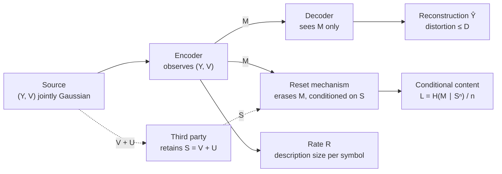
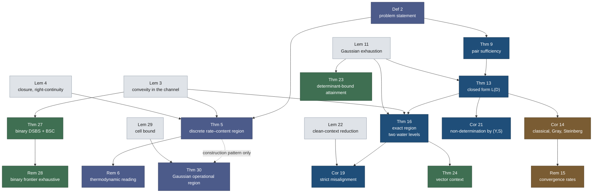
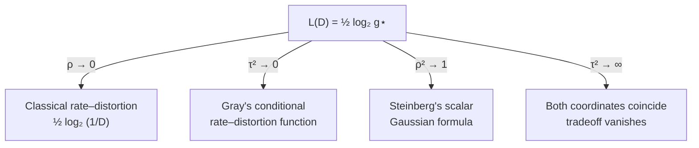

# Tradeoffs Between Rate and Conditional Content with Encoder-Observed Context

**→ [Read the paper (PDF, 35 pp)](tit-cr-context.pdf)** · [HTML rendering](tit-cr-context.html) · [cover letter](cover-letter-tit.pdf)

The PDF is canonical. The HTML is a self-contained reading convenience with
the mathematics as MathML and the figures inlined.

IEEE Transactions on Information Theory submission. Single author. 35 pp.

An encoder observes a jointly Gaussian pair `(Y, V)` and describes `Y` for a
decoder that sees the description alone. A third party retains a noisy copy
`S = V + U` of the context and never reconstructs anything. The paper prices
the description twice, by its rate and by its content conditional on what the
third party retains, and characterizes the exact region of pairs those two
prices can take.

**Status: submission-grade.** Five full independent verification passes plus a
dedicated audit of the coding theorem, all confirmed. Remaining gates are
owner-only and listed at the bottom.

---

## The result in one box

For the Gaussian source, the minimal conditional content at distortion `D` is

```
L(D) = ½ log₂ g⋆       g⋆ = larger root of   P(g) = D s g² − (D + s − ρ²) g + (1 − ρ²)
```

with `s = 1 + τ²` the context-noise parameter, `ρ` the correlation between the
described variable and the context, and `τ²` the variance of the third party's
observation noise. The rate coordinate is the ordinary one. The two coordinates
are minimized by *different* channels whenever `0 < ρ² < 1`, which is what
makes the region two-dimensional rather than a point.

---

## The operational model



<details>
<summary>Static PNG, if the diagram above does not render</summary>


</details>

Two things the diagram is drawn to make unmistakable. The decoder never sees
`S`, so this is not a decoder-side-information problem and the rate coordinate
gets no Wyner-Ziv saving. The reset mechanism *does* access `M`, because it has
to in order to erase it; `S` only conditions that erasure.

---

## Map of the results

Numbers are the shared counter in the current build. Roles follow the paper's
own labels: core results carry the contribution, consequences follow from them,
extensions widen the setting, anchors check the formula against known cases.



<details>
<summary>Static PNG, if the diagram above does not render</summary>


</details>

Reading the colors: dark blue is the setup and operational layer, deep blue the
five core results, grey the supporting lemmas, green the extensions, brown the
anchors.

The dashed edge is deliberate and load-bearing. The Gaussian operational
theorem reuses the *construction pattern* of the discrete one but proves its
own converse and achievability, so no Gaussian result depends on the
finite-alphabet theorem. A dedicated audit checked that specific dependency
direction and confirmed it.

---

## How the formula degenerates



<details>
<summary>Static PNG, if the diagram above does not render</summary>


</details>

Each limit is a check, not decoration: recovering three known functions at
three boundaries is what makes a sign or normalization error unlikely.
Remark 15 gives the *rates*, all linear, with coefficients derived by implicit
differentiation at the simple root:

| Anchor | Leading coefficient of the gap | Approached |
|---|---|---|
| `ρ² → 0` | `−(1−D) / (2 ln2 (s−D))` | from below |
| `τ² → 0` | `ρ² / (2 ln2 (1−ρ²−D))` | from above |
| `ρ² → 1` | `τ²(1−D) / (2 ln2 (D+τ²)²)` | from above |

The `τ² → 0` coefficient diverges at `D = 1 − ρ²`, where the quadratic's roots
collide; the paper states the far branch `D > 1 − ρ²` separately.

---

## Build and verify

```bash
# manuscript (run twice for cross-references)
pdflatex -interaction=nonstopmode tit-cr-context.tex
pdflatex -interaction=nonstopmode tit-cr-context.tex
# expect: 35 pages, zero undefined references, zero overfull hboxes

# cover letter
pdflatex -interaction=nonstopmode cover-letter-tit.tex    # 1 page

# verification
python verify_converses.py        # 19 checks: S1–S7 symbolic, N1–N12 numeric
python verifier_sym_checks.py     # 46 symbolic, independently commissioned
python verifier_num_checks.py     # 42 numeric,  independently commissioned

# figures (regenerate PDFs and PNGs; each prints the numbers its caption quotes)
python plot_frontier.py
python plot_notmarginal.py
python plot_binary.py

# this README's diagram fallbacks, after editing any mermaid block above
cd readme-figs
for n in model results-map anchors; do
  npx -y @mermaid-js/mermaid-cli -i $n.mmd -o $n.png -b white -w 1400 -s 2
done
```

The `.mmd` sources under `readme-figs/` are copies of the mermaid blocks in
this file. If you edit a diagram here, update the matching `.mmd` and
re-render, or the fallback PNG will silently disagree with the diagram above
it.

MATLAB Symbolic checks are in `matlab_checks.m` (11 checks, archived result).
The Lean 4 formalization of the load-bearing algebra lives outside this folder
at `../../lean/ObservationTheory/CRContext.lean` and carries zero `sorry`.

---

## Files

| File | What it is |
|---|---|
| `tit-cr-context.tex` | The manuscript. IEEEtran, single shared theorem counter. |
| `tit-cr-context.pdf` | Canonical build, 35 pp. |
| `tit-cr-context.html` | Self-contained reading rendering: MathML, figures inlined, theme-aware. Convenience only; the PDF governs. |
| `cover-letter-tit.tex/.pdf` | Editor cover letter, 1 p. States the three primary contributions and the relationship to the declined synthesis and the archived record. |
| `verify_converses.py` | Author's harness, written alongside the proofs. 19 checks. |
| `verifier_sym_checks.py`, `verifier_num_checks.py` | Re-derivation commissioned without access to the derivations or to the first harness. 46 + 42 checks. |
| `matlab_checks.m` | MATLAB Symbolic cross-check, 11 checks. |
| `plot_frontier.py` → `frontier.pdf/.png` | Fig 2: Pareto frontier at `(ρ², τ², D) = (0.75, 0.5, 0.3)`. |
| `plot_notmarginal.py` → `notmarginal.pdf/.png` | Fig 3: the two non-determination instances contrasted. |
| `plot_binary.py` → `binary.pdf/.png` | Fig 4: binary tilt root, objective, and rate–content frontier. |
| `VERIFICATION.md` | Full script inventory and what each check covers. |
| `EXTRACTION-PLAN.md` | Provenance and the complete revision log, M1 through M9. |
| `readme-figs/*.mmd`, `*.png` | Sources and static renderings of this file's three diagrams. The mermaid blocks below each heading are authoritative; the PNGs are fallbacks for viewers that do not render mermaid. |

Figure 1 (the system diagram) is TikZ inline in the `.tex`, not a separate file.
`*.log`, `*.aux`, `*.out` are build scratch and are gitignored.

---

## Numbers that appear in the paper

Every one is printed by a script; none is transcribed by hand.

| Quantity | Value | Source |
|---|---|---|
| Frontier endpoint excesses at `(0.75, 0.5, 0.3)` | `0.0400` and `0.0349` bits | `plot_frontier.py` |
| Largest excesses over the interior box | `ΔR = 0.1138`, `ΔL = 0.0770` bits | `verify_converses.py` N11 |
| Rate excess near the clean-context boundary | `1.537` bits at `τ² = 10⁻³`, and unbounded | N11 |
| Content-excess saturation there | `½ log₂(1+ρ²)` | N11 |
| Non-determination: common reduced correlation | `0.7071` | `plot_notmarginal.py` |
| Non-determination: content gap | `0.0495` bits at `D = 0.1`, `0.1543` at `D = 0.3` | `plot_notmarginal.py` |
| Binary tilt root at `(p,q,D) = (0.1, 0.1, 0.05)` | `d₀⋆ = 0.0282` | `plot_binary.py` |

The rate excess being *unbounded* is the answer to the natural objection that
the tradeoff, while strict, might always be numerically negligible. It is not.

---

## Verification history

Five fresh-context adversarial passes over the manuscript, each run without
access to the author reasoning that produced the text. All returned confirmed;
the fifth covered the complete text. A further dedicated pass audited the
discrete coding theorem alone across five probe points (deterministic code selection over the
joint ensemble, the conditional-entropy accounting under the selected code's
own index distribution, hypothetical-decoder hygiene, independence of the
Gaussian results, and single-letterization) and found no gap.

Findings from those passes were applied rather than filed; `EXTRACTION-PLAN.md`
records each round.

---

## Before submission (owner only)

- [ ] Steinberg 2009 binary example, institutional read
- [ ] Lu et al., WCSP 2016, institutional read
- [ ] Chen et al. (arXiv:2607.09545) — re-check for an Xplore record; currently cited as to be published
- [ ] Re-run the novelty sweep at submission time (house rule)
- [ ] Decide the Section VI split-out question raised in external review
- [ ] Upload to ScholarOne with `cover-letter-tit.pdf`
